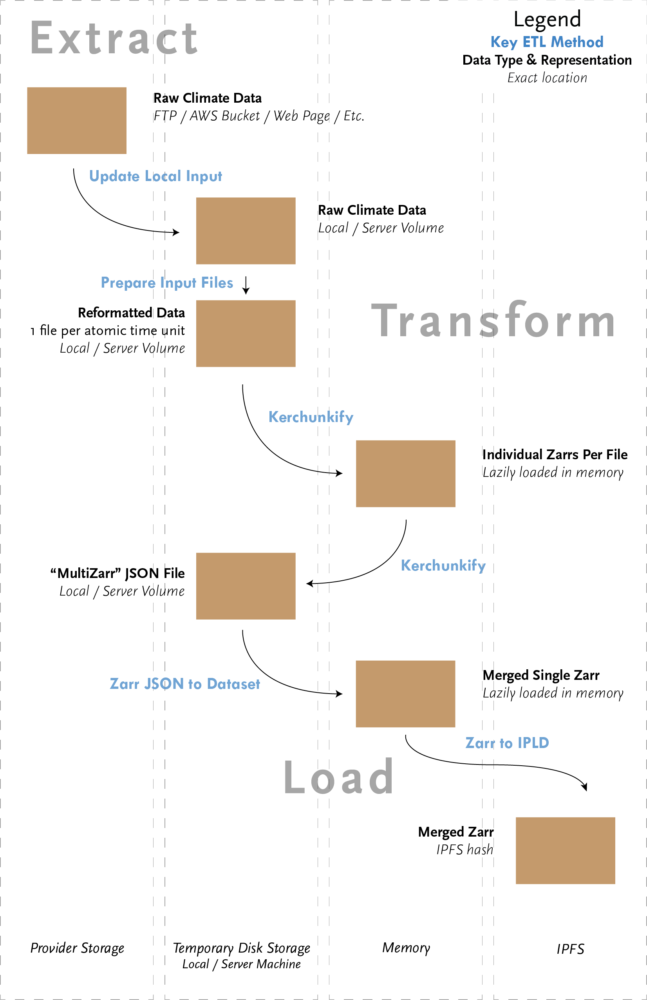

Zarr-climate-etl-ipfs
=====================

Zarr-climate-etl-ipfs is a set of utilities for retrieving publicly shared climate data, converting it to a common format, and adding it to [IPFS](https://ipfs.tech/). It is effectively a specialized web scraper for climate data that converts the data to a common [Zarr](https://zarr.readthedocs.io/en/stable/)[^1] format and shares it in a distributed fashion. 

Zarr-climate-etl-ipfs's utilities are combined in a DatasetManager abstract base class that can be adapted to retrieve data from a custom source. This abstract base class powers manager classes that can perform automated [data retrieval, transformation, and storage cycles](https://en.wikipedia.org/wiki/Extract,_transform,_load) (also known as ETLs) for a respective data source. The manager classes are also able to update, modify, and append to existing data in storage. We provide [an example ETL](etls/managers/chirps.py) for the [Climate Hazards Group InfraRed Precipitation with Station data (CHIRPS)](https://www.chc.ucsb.edu/data/chirps) dataset.

How to use this repository
--------------------------

This repository provides a workflow for building climate data ETLs that output to IPFS. This workflow utilizes a set of common methods in sequence to download raw data, transform it into suitable intermediate NetCDF4 Classic data files, lazily read them as Zarrs, and finally write the overall dataset to a Zarr. If a dataset already exists it will automatically update the existing dataset with any new files found during the process.

Users of this library are expected to build ETLS by importing utility methods directly from the [etls/utils](etls/utils/) folder, rather than importing the package like `pandas` or a similar library. Future iterations of this repository will be packaged for standalone import via PyPI in order to permit a more "normal" workflow. For more information see the [Development roadmap](docs/development_roadmap.md).

The below graphic provides a high level overview of the full anticipated workflow and the key methods for each step. These methods are covered in detail in the [ETL README](etls/README.md) and demonstrated in the example CHIRPS ETL in the [managers](etls/managers) directory.

ETL utilities are combined in a master [DatasetManager](etls/dataset_manager.py) that serves as a base class for ETL managers stored in [etls/managers](etls/managers/) (or elsewhere). ETL child classes may need to inherit and transform one or many parent methods from the utils folder; where anticipated these methods are marked as **@abstractmethod** to prompt the user.

When [run](#quickstart), ETLs will first download raw data to a **datasets** directory and later output finalized data to a **climate** directory, creating either directory if they don't yet exist. Note that the storage and RAM requirements for ETLs make it impractical to download and parse large time frames for most datasets on local machines.[^2]

ETL logs are output to the [logs](logs) folder. Two types of logs are output, INFO and DEBUG. In practice the DEBUG log will be *very* verbose due to each individual Dask worker processes outputting to this log: use with care.

Each ETL should have a dedicated unit test for any important or unique processing and parsing methods to ensure changes to the code base do not affect datasets in production and speed up development of the ETLs. Unit tests can be run from within the [tests](tests) folder using `pytest`. Further instructions are included in [that directory's README](tests/README.md).

Requirements
------------

* A Python 3.10.9 virtual environment for developing and running ETLs set up with the [required libraries](requirements.txt). See [the virtual environment setup walkthrough](doc/Python_virtual_environment.md) for more details. Note that other Python versions may work, but this is the version developed and tested against. It is strongly recommended to use a virtual environment since there are a lot of external modules to install, but it is not strictly necessary.

* [IPFS 0.10+](https://github.com/ipfs/go-ipfs/) node **with running daemon** (see [further instructions](docs/ipfs_node_management.md) for installation on a Linux machine)

Quickstart
----------

First [install and activate a Python virtual environment](docs/python_virtual_environments.md) and [IPFS](docs/ipfs_node_management.md).

Once a Python virtual environment and IPFS node are installed, an IPFS daemon must first be instantiated. Open a terminal and run

    ipfs daemon &

With the IPFS daemon up and running the script `generate_zarr.py` can be used to run a climate data retrieval and transformation. The CPC U.S. precipitation dataset, for example, is relatively small and can be run in a few minutes. To run a data retrieval, transformation, and storage cycle for the `CPCPrecipUS` class in [cpc.py](etls/managers/cpc.py), run

    ./generate_zarr.py cpc_precip_us

A folder containing the original data from CPC is created in `datasets/cpc/precip/us` at the root of the repository

    $ ls datasets/cpc/precip/us
    precip.V1.0.2007.nc
    ...
    precip.V1.0.2022.nc
    
The data is then read, transformed into Zarr format, and added to IPFS. At the end of the run, there will be a key added to the IPFS node.

    $ ipfs key list -l | grep cpc_precip_us
    [IPNS HASH]    cpc_precip_us-daily

Follow that IPNS hash to get to the standalone metadata for the generated CPC U.S. precipitation Zarr

    $ ipfs dag get $(ipfs name resolve $(ipfs key list -l | grep cpc_precip_us | cut -d ' ' -f1)) | python -m json.tool
    {
      "assets": {
        "zmetadata": {
          "description": "Consolidated metadata file for cpc_precip_us Zarr store, readable as a Zarr dataset by Xarray",
    ...

In that metadata, there is a link to the Zarr in `assets->zmetadata->href`

    "href": {
      "/": "bafyreibnfezcttd5zcjlp74lohe3ieqmtc73cybvfhh6ugzusxc2yi6ky4"
    }
    
The Zarr containing the climate data can be opened with `xarray` and `ipldstore`, which were installed during the virtual environment setup

    $ ipython
    > import xarray, ipldstore
    > mapper = ipldstore.get_ipfs_mapper()
    > mapper.set_root("bafyreibnfezcttd5zcjlp74lohe3ieqmtc73cybvfhh6ugzusxc2yi6ky4")
    > xarray.open_zarr(mapper, consolidated=False)
    <xarray.Dataset>
    Dimensions:    (latitude: 120, longitude: 300, time: 5736)
    Coordinates:
      * latitude   (latitude) float32 20.12 20.38 20.62 20.88 ... 49.38 49.62 49.88
      * longitude  (longitude) float32 -129.9 -129.6 -129.4 ... -55.62 -55.38 -55.12
      * time       (time) datetime64[ns] 2007-01-01 2007-01-02 ... 2022-09-14
    Data variables:
      precip     (time, latitude, longitude) float32 dask.array<chunksize=(1769, 24, 24), meta=np.ndarray>
    ...

For further help using the generate script, and to understand its various optional flags, use the `-h` flag

    ./generate_zarr.py -h

dClimate
--------

In some places this library's documentation references sharing of data and metadata over [dClimate's Data Marketplace](https://alpha.marketplace.dclimate.net) and its [API](https://api.dclimate.net/). [The dClimate project](https://www.dclimate.net/) includes a decentralized network for climate data, and Arbol's use of its Marketplace reflects our policy of publishing publicly licensed data we processes so that others can creatively reuse it. dClimate's Marketplace and API make it easier to explore, query, and share onwards data and metadata, getting the most out of prepared datasets.

However, this tooling in no way forces its users to similarly expose their data. Users may use data internally, expose it over different APIs, expose it over dClimate, or any other combination of reuses permitted by the license of the dataset they are working with. We only mention dClimate to clarify the full intended use and life cycle of datasets processed by Arbol.

Documentation
-------------

Documentation for how to use this repository is spread over several files. A development goal after the initial release of this library as open source is to unify the docs in a `readthedocs` instance. Until then, you can use the below links to navigate to topics of interest

[Understanding this repository](docs/understanding_this_repository.md)

[Setting up a Python environment](docs/python_virtual_environments.md)

[Installing and managing an IPFS node](docs/ipfs_node_management.md)

[Creating ETLs](etls/README.md)

[Logging ETLs](docs/logging.md)

[Registering dataset sources](docs/registering_dataset_sources.md)

[Building and running tests](tests/README.md)

[Out of scope topics](docs/out_of_scope.md)

[Development roadmap](docs/roadmap.md)

A special mention goes to the Pangeo project and in particular its Pangeo Forge initiative. Pangeo and its collaborators have directly inspired this work and indeed provide some of the formative tools behind it (e.g. Kerchunk). We encourage readers considering using this library to also consider the tools and recipes on offer by Pangeo; in some cases they may be easier to adapt and/or more applicable to their needs.

[Pangeo](https://pangeo.io/)

[Pangeo Forge](https://pangeo-forge.org/)

[Pangeo Forge Recipes](https://github.com/pangeo-forge/pangeo-forge-recipes)

[^1]: Zarr is a data store which represents N-dimensional data using a key:value system. The actual format of this system is flexible: Zarrs can be JSONs, nested folder structures on disk, or any other key:value store that makes sense. They are essentially a directory structure with a lightweight JSON metadata on top describing the dataset and efficiently directing retrieval operations to the needed byte ranges. Despite this flexibility and simplicity, Zarrs scale efficiently to massive (many TB) sizes effectively and carry far less baggage than traditional formats like GRIB, NetCDF, etc: unlike these formats built for other computing and access paradigms, Zarrs have been designed explicitly for cloud-based access and retrieval.

[^2]: In practice most ETLs will output data to remote servers and not use the **climate** directory at all. This is not merely because remote servers are better for exposing data to others: many full historical climate datasets consume hundreds of GBs or many TBs of space and are impractical to manage on a local machine. Additionally, successfully parsing from old file formats to new file formats in many cases exceeds the amount of RAM available on personal computers. We frequently need 128 to 256 GB of RAM to parse large datasets like ERA5.
