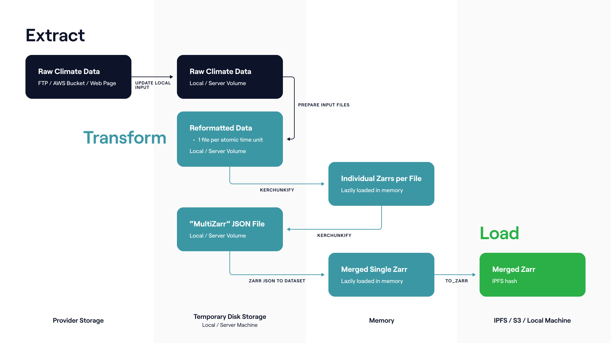

Zarr_etl_tools
==============

Zarr_etl_tools is a set of utilities for retrieving publicly shared climate data, converting it to a common format, and adding it to [IPFS](https://ipfs.tech/). It is effectively a specialized web scraper for climate data that converts the data to a common [Zarr](https://zarr.readthedocs.io/en/stable/)[^1] format and shares it in a distributed fashion. 

Zarr_etl_tools's utilities are combined in a DatasetManager abstract base class that can be adapted to retrieve data from a custom source. This abstract base class powers manager classes that can perform automated [data retrieval, transformation, and storage cycles](https://en.wikipedia.org/wiki/Extract,_transform,_load) (also known as ETLs) for a respective data source. The manager classes are also able to update, modify, and append to existing data in storage.

How to use this repository
--------------------------

This repository provides a workflow for building climate data ETLs that output to IPFS, S3, or a local file system. This workflow utilizes a set of common methods in a predictable sequence to download raw data, transform it into suitable intermediate data files, lazily read them as Zarrs, and finally write the overall dataset to a Zarr on the desired storage medium. If a dataset already exists it will automatically update the existing dataset with any new files found during the process.

Users of this library should build ETLS for a desired gridded climate dataset by importing the library within an ETL manager script, using the `DatasetManager` class from [DatasetManager](dataset_manager.py) as a base class, then applying its standardized workflow to the climate dataset in question. ETL child classes will need to overload one or many parent properties or methods from the [utils](utils) directory; the exact number depends on the intricacies of how the raw climate data is packaged. Where anticipated these methods are marked as **@abstractmethod** to prompt the user. See 

 The [ETL developers manual](docs/etl_developers_manual.md) provides precise instructions on how to build your own manager using the library. These are demonstrated in [an example ETL](examples/managers/chirps.py) for the [Climate Hazards Group InfraRed Precipitation with Station data (CHIRPS)](https://www.chc.ucsb.edu/data/chirps) dataset in the [managers](examples/managers) directory. The below graphic provides a high level overview of the full anticipated workflow and the key methods for each step.



Users of this library can run the ETLs they build on the command line or within a notebook environment, as described below in [quickstart](#quickstart), When run, an ETL will first download raw data to a **datasets** directory and later output finalized data to a **climate** directory, creating either directory if they don't yet exist. Note that the storage and RAM requirements for ETLs make it impractical to download and parse large time frames for most datasets on local machines.[^2]

ETL logs are output to a [logs](logs) folder in the parent directory of your managers. Two types of logs are output, INFO and DEBUG. In practice the DEBUG log will be *very* verbose due to each individual Dask worker processes outputting to this log: use with care.

Each ETL should have a dedicated unit test for any important or unique processing and parsing methods to ensure changes to the code base do not affect datasets in production and speed up development of the ETLs. Unit tests can be run from within the [tests](examples/tests) folder using `pytest`. Further instructions are included in [that directory's README](examples/tests/README.md).


Requirements
------------

* A Python 3.10.9 virtual environment for developing and running ETLs set up with the [required libraries](requirements.txt). See [the virtual environment setup walkthrough](doc/Python_virtual_environment.md) for more details. Note that other Python versions may work, but this is the version developed and tested against. It is strongly recommended to use a virtual environment since there are a lot of external modules to install, but it is not strictly necessary.

* [IPFS 0.10+](https://github.com/ipfs/go-ipfs/) node **with a running daemon** (see [further instructions](docs/ipfs_node_management.md) for installation on a Linux machine)


Quickstart
----------

#### Setup

First install the library from the github repository using `pip`. We recommend doing so within [a Python virtual environment](docs/python_virtual_environments.md).

    pip install git+https://github.com/Arbol-Project/zarr-climate-etl@generate

Next install IPFS, as per [the docs](docs/ipfs_node_management.md).

Once the library and an IPFS node are installed, instantiate an IPFS daemon. Open a terminal and run

    ipfs daemon &

Keep the terminal open as you move through the rest of the quickstart

#### Running the ETL

With the IPFS daemon up and running manager scripts using the `zarr_etl_tools` library can be invoked within a separate script or notebook. Note you will have to first create a functioning manager script, as described in the [ETL developers manual](docs/etl_developers_manual.md). We use the CHIRPS example manager included in this repository below.

The CHIRPS U.S. precipitation dataset is of medium size and can be run in a few hours on a well powered machine. To run a data retrieval, transformation, and storage cycle for the `CHIRPSFinal25` class in [chirps.py](examples/managers/chirps.py), import and instantiate it within a notebook or script

    import datetime
    from examples.managers.chirps import CHIRPSFinal25
    etl = CHIRPSFinal25(store='ipld')

Now run the `update_local_input` to download all the files for this dataset. We're going to use the **date_range** parameter to only download files for 2021 and 2022 so this example goes quickly. Note that you can skip this step if you already have your files!

    etl.update_local_input(date_range=[datetime.datetime(2021, 1, 1), datetime.datetime(2022, 12, 31)])

After running `update_local_input` a folder containing the original data from CHIRPS is created in `datasets/chirps/final/25` in the parent directory of the directory holding the CHIRPS manager

    $ ls datasets/chirps/final/25
    chirps-v2.0.2021.days_p25.nc
    chirps-v2.0.2022.days_p25.nc

Now run the `parse` method to read all the files, transform them into a single Zarr, and place that Zarr on the desired store.

    etl.parse()

#### Retrieving your dataset

How you find and retrieve the Zarr you just created will depend on the store used. Because we specified the IPLD store above, the output text from our ETL will specify the IPFS hash associated with the final Zarr.

    INFO     <chirps_final_25> IPFS hash is bafyreibx5i7ovu2ed2qyh2ajezfsxvufjbihwscur5hkue4zol6fcwefjq

This hash can be used to open the dataset in an interactive session using `xarray` and `ipldstore` in tandem. These were installed during the virtual environment setup

```python
    import xarray, ipldstore
    mapper = ipldstore.get_ipfs_mapper()
    mapper.set_root("bafyreibx5i7ovu2ed2qyh2ajezfsxvufjbihwscur5hkue4zol6fcwefjq") # replace with your hash
    xarray.open_zarr(mapper, consolidated=False)
    <xarray.Dataset>
    Dimensions:    (latitude: 120, longitude: 300, time: 5736)
    Coordinates:
      * latitude   (latitude) float32 20.12 20.38 20.62 20.88 ... 49.38 49.62 49.88
      * longitude  (longitude) float32 -129.9 -129.6 -129.4 ... -55.62 -55.38 -55.12
      * time       (time) datetime64[ns] 2007-01-01 2007-01-02 ... 2022-09-14
    Data variables:
      precip     (time, latitude, longitude) float32 dask.array<chunksize=(1769, 24, 24), meta=np.ndarray>
    ...
```

Note that the IPFS hash for a dataset can be found at any time by consulting the `assets->zmetadata->href->'/'` field in its STAC metadata. This includes previous iterations of your dataset -- just roll back to the associated STAC metadata.

#### Further information 

For further help invoking scripts and retrieving datasets, including over Amazon's s3 or a local file system, consult [the ETL running manual](docs/running_an_etl.md). To understand the various optional invocation flags, consult the docstring for the `run_etl` function in the [dataset_manager script](dataset_manager.py#296)

dClimate
--------

In some places this library's documentation references sharing of data and metadata over [dClimate's Data Marketplace](https://alpha.marketplace.dclimate.net) and its [API](https://api.dclimate.net/). [The dClimate project](https://www.dclimate.net/) includes a decentralized network for climate data, and Arbol's use of its Marketplace reflects our policy of publishing publicly licensed data we processes so that others can creatively reuse it. dClimate's Marketplace and API make it easier to explore, query, and share onwards data and metadata, getting the most out of prepared datasets.

However, this tooling in no way forces its users to similarly expose their data. Users may use data internally, expose it over different APIs, expose it over dClimate, or any other combination of reuses permitted by the license of the dataset they are working with. We only mention dClimate to clarify the full intended use and life cycle of datasets processed by Arbol.


Documentation
-------------

Documentation for how to use this repository is spread over several files. A development goal after the initial release of this library as open source is to unify the docs in a `readthedocs` instance. Until then, you can use the below links to navigate to topics of interest

[Understanding this repository](docs/understanding_this_repository.md)

[Setting up a Python environment](docs/python_virtual_environments.md)

[Installing and managing an IPFS node](docs/ipfs_node_management.md)

[Creating ETLs](docs/etl_developers_manual.md.md)

[Running ETLs](docs/running_an_etl.md)

[Logging ETLs](docs/logging.md)

[Registering dataset sources](docs/registering_dataset_sources.md)

[Building and running tests](examples/tests/README.md)

[Out of scope topics](docs/out_of_scope.md)

[Development roadmap](docs/development_roadmap.md)

A special mention goes to the Pangeo project and in particular its Pangeo Forge initiative. Pangeo and its collaborators have directly inspired this work and indeed provide some of the formative tools behind it (e.g. Kerchunk). We encourage readers considering using this library to also consider the tools and recipes on offer by Pangeo; in some cases they may be easier to adapt and/or more applicable to their needs.

[Pangeo](https://pangeo.io/)

[Pangeo Forge](https://pangeo-forge.org/)

[Pangeo Forge Recipes](https://github.com/pangeo-forge/pangeo-forge-recipes)

[^1]: Zarr is a data store which represents N-dimensional data using a key:value system. The actual format of this system is flexible: Zarrs can be JSONs, nested folder structures on disk, or any other key:value store that makes sense. They are essentially a directory structure with a lightweight JSON metadata on top describing the dataset and efficiently directing retrieval operations to the needed byte ranges. Despite this flexibility and simplicity, Zarrs scale efficiently to massive (many TB) sizes effectively and carry far less baggage than traditional formats like GRIB, NetCDF, etc: unlike these formats built for other computing and access paradigms, Zarrs have been designed explicitly for cloud-based access and retrieval.

[^2]: In practice most ETLs will output data to remote servers and not use the **climate** directory at all. This is not merely because remote servers are better for exposing data to others: many full historical climate datasets consume hundreds of GBs or many TBs of space and are impractical to manage on a local machine. Additionally, successfully parsing from old file formats to new file formats in many cases exceeds the amount of RAM available on personal computers. We frequently need 128 to 256 GB of RAM to parse large datasets like ERA5.
