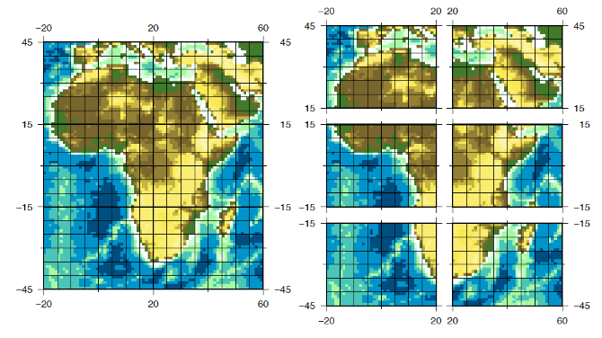

ETL Developer's Manual
======================

This README expands on the [library README](../README.md), which explains the logic behind the structure of the library and how to run the CHIRPS ETL manager example script. If you have not read that yet, do so before reading the below.

Writing a new gridded climate data ETL class, at its most basic level, is achieved by inheriting [DatasetManager](dataset_manager.py) and implementing its abstract methods, particularly `extract` for retrieval and a `parse` method that optionally modifies the format of the data and writes the data to IPFS, S3, or a local file system.

New climate datasets can be added by creating a child class for that dataset within the manager script for the overall source. The recommended practice is to create child classes for each climate variable (minimum temperature, water salinity, etc.) extracted from that source -- e.g. CHIRPSFinal05 for the CHIRPS data source. Abstractly, a new dataset's manager will look like:

    # manager_script.py

    from gridded_etl_tools.dataset_manager import DatasetManager

    Class MyNewETL(DatasetManager):
        # ETL content here

    Class MyNewETLDataset(MyNewETL):
        # Further ETL content here

This guide answers the question of what are the "ETL contents" in the above comments. More specifically, how can users best leverage and adapt the workflow and methods within the DatasetManager to make their own ETL?

To run the manager script for a given child class follow the instructions under [the ETL invocation documentation](./running_an_etl.md).


Zarr ETLs
---------

gridded_etl_tools retrieves, transforms, and stores N-Dimensional gridded datasets in [Zarr](https://zarr.readthedocs.io/en/stable/) format directly on [IPFS](https://ipfs.tech/). 

Legacy climate data providers frequently publish climate data as individual files per period in a datasets' time series (e.g. one file per day) because bandwidth and hard disk space previously constrained many users's ability to download and process massive files. Today this complicates retrieval and consolidation in more performant modern systems. Fully implemented managers are able to retrieve the files composing an overall dataset, transform them into Zarr-compatible formats, and create or update a single final output Zarr containing all of their data.

The output datasets for gridded data produced using gridded_etl_tools are meant to be read and transformed by [dClimate-Zarr-Client](https://github.com/dClimate/dClimate-Zarr-Client) and served by [dClimate-Zarr-API](https://github.com/dClimate/dClimate-Zarr-API).

Standalone metadata for datasets and their sources are stored over IPFS in formats compatible with the Spatio-Temporal Asset Catalog ([STAC](https://stacspec.org/en)) industry metadata standard -- see the [metadata guide](./metadata_standard.md) for more details.

### Overview

The following parameters must be defined per dataset

* Zarr/dask/IPFS chunk sizes
* standard_dims
* Name, collection, temporal_resolution, missing_value_indicator (_metadata_)
* Remote_protocol, identical_dims, concat_dims, engine (_kerchunk_)
* Climate_variable, tags, temporal and spatial resolution (_metadata_)

The following methods _must_ be (highly) customized per dataset

* `extract`

The following methods _may_ need to be (lightly) customized per dataset

* `prepare_input_files`
* `mzz_opts`
* `preprocess_kerchunk`
* `postprocess_zarr`
* `populate_metadata`
* `set_zarr_metadata`
* `update_zarr` (or its modular component methods `update_setup` and `update_operations`)

### Conceptual Overview

#### Data manipulation

Arbol's architecture makes heavy use of three libraries to efficiently store and retrieve datasets: [Zarr](https://zarr.readthedocs.io/en/stable/), [Kerchunk](https://github.com/fsspec/kerchunk), and [Xarray](https://docs.xarray.dev/en/stable/).

#### Zarr

Zarr is a data store which represents N-dimensional data using a key:value system. The actual format of this system is flexible: Zarrs can be JSONs, nested folder structures on disk, or any other key:value store that makes sense. They are essentially a directory structure with a lightweight JSON metadata on top describing the dataset and efficiently directing retrieval operations to the needed byte ranges. Despite this flexibility and simplicity, Zarrs scale efficiently to massive (many TB) sizes effectively and carry far less baggage than traditional formats (e.g. GRIB, NetCDF) because Zarrs were explicitly designed for cloud-based access and retrieval instead of older, local machine based computing and access paradigms.

More information on Zarrs can be found at [Zarr's readthedocs](https://zarr.readthedocs.io/en/stable/).

#### Kerchunk

Kerchunk is a new, rapidly evolving library which reads N-dimensional datasets in traditional formats (GRIB, NetCDF, etc.) into a lightweight, Zarr-compatible JSON without needing to actually (laboriously) open them. It allows users to combine many such JSONs into one master JSON representing all the datasets as a single Zarr which can be lazily loaded. Crucially, it leverages `fsspec` to find the actual data bytes of traditional datasets and store these data in the JSON as reference byte ranges without expensively opening, loading, or outputting the data. The resulting JSON is readable by Xarray as a Zarr.

Kerchunk allows users to preprocess data on read or postprocess on output in order to create new dimensions, reformat/rename data, or otherwise manipulate the dataset. This is important because in practice Kerchunk is picky about the formatting of input datasets (due to some misalignments between how `xarray` and the underlying `h5py` / `cfgrib` libraries process data). Inconsistencies with input datasets can cause it to fail in undocumented or hard-to-diagnose ways. To avoid problems we standardize input datasets as NetCDF4 Classic before input and use preprocess/postprocess methods to create needed attributes or dimensions. Because N-dimensional datasets were historically packaged in different ways these preparatory operations are often dataset specific.

#### Xarray

Xarray is a well-established library for reading and manipulating N-dimensional datasets in Python. It provides a user-friendly interface for looking at data and a number of convenience functions for querying, slicing, or repackaging datasets. Under the hood it leverages Dask to automatically parallelize most operations for large efficiency gains.

#### Metadata concepts

Arbol's architecture conforms to the Spatio-Temporal Asset Catalog (STAC) standard for metadata. STAC is a metadata standard originally designed to standardize metadata for large collections of satellite imagery and so facilitate data discovery across many datasets and providers. It has become _the_ standard for metadata in the geospatial industry and as a result the community has built a still-growing suite of complementary open-source tools for searching and serving data. We have adapted it in order to ease adoption of some of these tools, make our data searchable by outside crawlers, and position dClimate to work well with the wider geospatial community.

The management of metadata within ETLs is addressed in the [metadata section](#metadata) of this README. The structure of resulting metadata is reviewed in a separate [metadata standard readme](./metadata_standard.md).

Technical documentation of STAC and its constituent parts can be found at [Radiant Earth's STAC Spec Github](https://github.com/radiantearth/stac-spec/).

### Chunking

Since N-Dimensional datasets are often extremely large data cannot be indexed and retrieved efficiently without subdividing them into smaller discrete arrays of data called _chunks_. Chunks are the atomic unit of data operations. When a user requests a subset of data for an operation, only the individual chunks containing that data need to be read in and held in memory, speeding up operations and allowing users to work with large datasets without overwhelming memory. For Zarrs and Xarray retrieved data take the form of individual numpy arrays.

#### Basics

Chunk sizes are defined by the shape of the chunk array -- i.e., how many values of each dimension go into a chunk, for example `{"time" : 500, "latitude" : 20, "longitude" : 20}`. These chunks can be thought of as dividing a 3 dimension space into pieces, as per the below graphic sourced from [Unidata](https://www.unidata.ucar.edu/blogs/developer/entry/chunking_data_why_it_matters).


Chunk shapes should be chosen so the dimension(s) most consistently needed in large quantities are largest. The default for most datasets is to provide many/all latitudes and longitudes for one time period, so that analyses of large areas per time period are fast. We prefer to provide large time chunks for small ranges of latitudes and longitudes as historical comparisons are Arbol's bread and butter. Note this implies worse performance (longer query times) when users *do* request large areas.

So for instance, looking at the below chunking scheme for an African dataset, historical analyses for all of Africa would be 6x slower than analyses of just Morocco because the former request requires pulling 6 chunks for every 1 pulled by the latter. An analysis of South Africa would be 2x slower because it spans the bottom two chunks.



_Graphic sourced from [CDO User's Guide](http://www.idris.fr/media/ada/cdo.pdf)_

#### Specifying chunks

Chunks are specified in the `__init__` of an ETL. This means that within a manager they would be specified like so...

    class CHIRPS(DatasetManager):
        def __init__(self, *args, 
                    # 0.05 dataset size is time: 15000, latitude: 2000, longitude: 7200
                    requested_dask_chunks = {"time": 200, "latitude": 25, "longitude": -1}, # 144 MB
                    requested_zarr_chunks = {"time": 200, "latitude": 25, "longitude": 50}, # 1 MB
                    requested_ipfs_chunker = "size-5000", 
                    **kwargs):
            """

...and within a notebook they would be specified like so

    from examples.managers.chirps import CHIRPSFinal05
    requested_dask_chunks = {"time": 200, "latitude": 25, "longitude": -1}, # 144 MB
    requested_zarr_chunks = {"time": 200, "latitude": 25, "longitude": 50}, # 1 MB
    requested_ipfs_chunker = "size-5000"

    etl = CHIRPSFinal05(requested_dask_chunks, requested_zarr_chunks, requested_ipfs_chunker)
    # proceed with ETL operations

But what values to assign these chunks? Read on...

#### Types of chunks

Confusingly, we work with three _types_ of chunks: dask, zarr, and ipfs chunks.

* Dask chunks are the chunk sizes that Dask works with when parsing out the dataset. Dask's documentation says it is most efficient with chunks of approximately 100-200 MB.
* Zarr chunks are the chunk sizes stored within the Zarr and retrieved by the Client. Small chunks of 1-5 MB are preferable to speed up retrieval.
* IPFS chunks are the chunks stored within IPFS. Since IPFS hashes represent each chunk, any change to a chunk from dataset updates will cause the entire chunk to duplicate. Therefore we want IPFS chunks sized equivalent to the size of each update issued for a dataset. For instance, ERA5 data is hourly but is issued as 1 day updates, so we batch 24 hourly data points into each IPFS chunk.

The relationship between these chunks is hierarchical, as per the graphic below.


#### Sizing principles

Chunk sizing for each dataset is part art and part science. The ideal chunking scheme will retrieve the fewest chunks in the fastest time for the intended analytical use case -- in Arbol's case, preparing statistics for small areas across large time periods. Even for this single use case no two dataset's ideal chunking scheme will look exactly the same because each dataset has a different range of times, spatial resolution, and spatial coverage.

The following principles should guide your choice of Dask chunk dimensions, which will in turn condition the size of all other chunks. Keep in mind that the true size (in bytes) of each chunk is the product of each dimension's size and 4 (the size in bytes of a data point in binary).

* Time chunks should be large (in the hundreds or thousands) to speed retrieval of large time series with relatively few chunks
* Latitude/longitude chunks should be sufficiently large to enable queries over small areas in a single chunk, i.e. 16x 16 or 30 x 30.
* Latitude and longitude chunk sizes must be even divisors of both range lengths -- e.g. PRISM has 120 latitudes and 300 longitudes, so 20 is chosen as a chunk size.
* Always set `longitude = -1` (all values) for Dask chunks as this greatly speeds up parses.
* Therefore dask and zarr chunk sizes should be chosen such that `time * latitude * {all longitudes} = ~100-200 MB` and `time * latitude * {zarr chunk longitude size} = ~1-6MB`. 

Because IPFS chunk sizes should equate to one day's worth of data, a simple mathematical relationship with the `zarr_chunk` sizes determines their ideal size. IPFS chunks are specified as **strings** because this is how they are manually passed in to IPFS settings.

* ipfs chunk size = `zarr_chunk` / `time_chunk` _(daily or weekly temporal resolution datasets)_
* ipfs chunk size = `zarr_chunk` / `time_chunk` * 24 _(hourly temporal resolution datasets)_

#### Chunking sizing examples

A few examples can help illustrate these principles in action. These examples refer to the chunk sizes as defined in the `init` of each manager class, as described in the [Abstract base class overview](#abstract-base-class-overview) section.

**ERA5** 

ERA5 is an hourly global dataset reaching back to 1950, meaning it has a huge overall time dimension of more than 639,000 datetimes. The chunking schema of ERA5 therefore favors large time chunks (5,000 datetimes) so that performance is adequate when modeling the entire time series. 

The tradeoff is that spatial coverage for each chunk is small -- 16 x 16 locations at 0.25 degrees of latitude or longitude each, so roughly 4 x 4 degrees latitude and longitude. Modeling of large areas will be very slow as a result.

Even with an hourly dataset we encode IPFS chunks of one day each, since ERA5 data is updated for 24 hours at a time and we want to maximize de-duplication. Therefore the IPFS chunk size for ERA5 has to be quite large (24,576 bytes) since it must encompass 24 separate data points.

```python
    requested_dask_chunks={"time": 5000, "latitude": 16, "longitude": -1},
    requested_zarr_chunks={"time": 5000, "latitude": 16, "longitude": 16},
    requested_ipfs_chunker="size-24576"
```

**PRISM**

PRISM is a daily dataset which only begins in 1991 and therefore has a much smaller time dimension of approximately 15,000 datetimes. 

The smaller time dimension means we can afford to make time chunks smaller relative to latitude/longitude without badly compromising the performance of queries over the full time range. As a result, queries for large areas with PRISM will perform better (quicker) relative to ERA5. 

Because the temporal resolution of PRISM is daily each IPFS chunk only has to encode a single data point. Therefore the IPFS chunks are much smaller than ERA5's hourly data.

```python
    requested_dask_chunks={"time": 625, "latitude": -1, "longitude": 27},
    requested_zarr_chunks={"time": 625, "latitude": 27, "longitude": 27},
    requested_ipfs_chunker="size-2916"
```

### Abstract base class overview

Arbol's ETL architecture makes heavy use of a **DatasetManager** base class which inherits and organizes functions derived from a number of **util** child classes. The inheritance relationship between the DatasetManager class and its child utils is fully described in the repo [README](../README.md) and will not be rehashed at length here.

A short summary of each util follows:

* **attributes**: Specifies properties common to all ETLs. Where possible properties are filled; where not marked as @abstractmethod to force ETL writers to instantiate them within the ETL.
* **convenience**: Provides convenience methods (repacking data, formatting strings and paths, etc.)
* **logging**: Instantiates and attunes loggers
* **IPFS**: Connects to, retrieves, and stores data on IPFS and/or IPNS
* **metadata**: Prepares, manipulates, and places STAC metadata on IPFS
* **zarr_methods**: Packages data transformation and load methods common to all Zarr ETLS. 

DatasetManager combines these utils in a structure common to all N-dimensional datasets being output as Zarrs. Specifically, it;

* Packages input datasets into a single JSON that Xarray can read as a single Zarr, without actually opening each dataset
* Lazily opens the resulting Zarr, performs any final metadata improvements, and writes it out to IPFS as a new dataset (first time) or an update to an existing dataset (subsequently)
* Creates, updates, and publishes STAC-compliant metadata based on metadata fields taken from the dataset's properties and the attributes of the output Zarr.

### ETL Overview

ETL managers adapt the above approach to the specificities of each dataset. They download datasets, transform them as needed to be readable as Zarrs, and then parse them out either using or adapting the tools from DatasetManager. 

Each gridded ETL can be divided into 5 stages

* Instantiation and parameter definition
* Update local input
* Processing data
* Parsing (and metadata preparation)
* Subclass definition

This section also reviews some tricky 'gotchas' that result from inputting older N-Dimensional formats into Xarray and outputting them as Zarrs.

#### Instantiation

Instantiation parameters specify the structure of an ETL, provide inputs to the metadata, Kerchunk's processing options, and/or flags used by Xarray.

The `init` of each manager should define the chunk sizes for the dataset (as described above) within the kwargs and any necessary instance variables below. The `standard_dims` variable is a necessary instance variable for all datasets. Others may be unique to the dataset manager, as with `input_history` and `testing_updates` for CHIRPS below.

```python
class CHIRPS(DatasetManager):
    """
    The base class for any CHIRPS set using Arbol data's architecture. It is a superclass of both CHIRPS Final
    (monthly updates of .05 and .25 resolution from 1981) and CHIRPS Prelim (weekly updates of 0.05 resolution, from 2016 to present).
    """
    def __init__(self, *args,
                # 0.05 dataset size is time: 15000, latitude: 2000, longitude: 7200
                requested_dask_chunks = {"time": 200, "latitude": 25, "longitude": -1}, # 144 MB
                requested_zarr_chunks = {"time": 200, "latitude": 25, "longitude": 50}, # 1 MB
                requested_ipfs_chunker = "size-5000", **kwargs):
        """
        Initialize a new CHIRPS object with appropriate chunking parameters.
        """
        super().__init__(requested_dask_chunks, requested_zarr_chunks, requested_ipfs_chunker, *args, **kwargs)
        self.standard_dims = ["latitude", "longitude", "time"]
```

#### Parameter definition

Parameters that are fixed for the dataset should be declared with a `@property` or `@classmethod` decorator immediately below the init (properties are more pythonic but failed during testing of some operations. Follow the existing ETLs for best results). Most of these parameters are necessary for `kerchunk` and `xarray` to interpret and read in the dataset or input files -- how is described in the docstring of each.

Static metadata is populated at the top of the ETL where common to the entire dataset or as properties within dataset subclasses when specific to that subclass. See the [Metadata Concepts][#metadata-concepts] section below for a more thorough explanation.

#### Update local input

The `extract` function and its helper methods retrieve new data from the provider. As providers' publication formats, methods, and schedules vary greatly this will be the most custom (and therefore laborious) part of any ETL. DatasetManager provides some useful methods for common operations, such as `sync_ftp_files`, but in most cases code will need to be written from scratch or adapted from a similar ETL.

`extract` can flexibly accept kwargs as required by the dataset being processed. Arbol's own ETLs make heavy use of the `date_range` kwargs. This kwarg parses a list of datetimes ([datetime.datetime, datetime.datetime]) into a range between which data will be downloaded and parsed.

For example, to download and parse CHIRPS Final 05 data between January 1, 2005 and June 31st, 2007 you would run the following

```python
    from examples.managers.chirps import CHIRPSFinal05
    etl = CHIRPSFinal05()
    etl.extract(date_range = [datetime.datetime(2005, 1, 1, 0), datetime.datetime(2007, 6, 31, 0)])
```

#### Processing

Raw datasets downloaded from providers are rarely well suited for amalgamation into a Zarr as-is. We use three different methods of pre- and post-processing to transform data.

* Preprocessing input data prior to reading by kerchunk (`preprocess_kerchunk`) 
* Preprocessing on Kerchunk read (`mzz_opts`)
* Additionally, we postprocess zarrs after they've been read into memory by Xarray (`postprocess_zarr`)

`Preprocess_kerchunk` is automatically applied to each dataset to correct a bug in Kerchunk that translates `0` values to `NaN`. It can be inherited and modified if necessary, but in most cases this is unnecessary and inadvisable as it requires a strong understanding of Kerchunk's internals.

`Mzz_opts` is a dictionary of arguments for Kerchunk's `MultiZarrtoZarr` method. This method has a powerful, albeit slightly convolutedm collection of methods for transforming input data that are best summarized in [the function's docstring](https://github.com/fsspec/kerchunk/blob/main/kerchunk/combine.py#L28). At a minimum, we populate the values of the `remote protocol`, `identical_dims`, `concat_dims`, and `preprocess` keys with the appropriate properties or methods; neglecting to do so will cause the ETL to fail. Additional appropriate uses of this method will depend on the dataset; for instance, we use this to encode time values corresponding to each PRISM input file based on the date contained in its filename.

`Postprocess_zarr` is called *after* a virtual Zarr has been read in by Xarray. It is useful to modify dimensions, data, or attributes that are Kerchunk compatible but will cause failures with our codebase and/or when writing out a Zarr. For instance, PRISM time stamps are encoded as strings by `MultiZarrtoZarr` and `postprocess_zarr` can be used to convert them to datetimes.

#### Parse

Parse contains three types of methods

* Metadata creation and updating methods
* Input file preparation
* Writing/updating Zarrs

Metadata methods are described in [Metadata concepts][#metadata-concepts] below.

Input file preparation (via `prepare_input_files`) is specific to each dataset. The goal is to repackage each dataset to one NetCDF4 Classic file per atomic temporal unit (e.g. days if data points are daily and hours if hourly). The atomic unit is a requirement for Kerchunk, which cannot read collections of data with inconsistently sized time chunks (e.g. monthly datasets, which have variable lengths). If data is provided in NetCDF formats then repackaging is easily adapted from existing code; if data is provided in alternative N-Dimensional formats or as single dimension formats it may require substantial work with data transformation libraries and/or command line tools like `gdal`, `cdo`, or `nc`. Consult existing ETLs for example code.

Zarr writing and updating routines are largely standardized within DatasetManager.py -- the ability to completely standardize inputs to the actual parsing is the great advantage of using Kerchunk for pre-processing. The only exceptions are the `set_zarr_metadata` method, used to strip out or reformat dataset attributes inherited from the original input files, and the `update_zarr` method, whose insert/append logic may very slightly depending on how updates to a dataset are prepared by the dataset provider.

Zarr writes/updates are instantiated within a Dask cluster to leverage Xarray's implementation of Dask parallelization under the hood when opening, processing, and writing datasets. This greatly accelerates parse speeds in ways that scale with greater computing power. Helpfully, Dask clusters also instantiate a dashboard which visualizes parsing operations in real time, showing the progress of each component task per worker. By default any ETL's dashboard can be followed at `http://<server_url>:8787/status`, where 8787 is a port number specified using the `dashboard_address` parameter in the cluster. If disabled the port number will default to `8787`, although for unknown reasons this port is sometimes blocked and it supplies a random one instead. Note that a failed dashboard does not imply a failed parse, just the inability to follow the parse visually.

#### Subclass definition

Subclasses describing each dataset in a collection (i.e. PRISM minimum temperature or ERA5 Land precipitation) should implement any methods specific to that subclass. In practice, this will mostly take the form of properties defining the name, unit of measurement, and other metadata fields specific to that dataset. In a few cases chunk sizes and/or kerchunk preprocessing methods may need to be modified, e.g. for ERA5 datasets that return longitudes as 0 - 360 degrees instead of -180 to 180.

#### Gotchas

Some input datasets come with **filters** and/or **compressors** specified in the input GRIB or NetCDF files. **Filters** will usually cause zarr writes to fail and a **compressor** will prompt compression which prevents IPFS from de-duplicating data. 

These flags are loaded in under the `encoding` dictionary of a dataset's data variables in Xarray, i.e. `dataset.tmax.encoding`. To prevent this we remove the **filters** entirely from the dictionary and set `compressor = None` for all data variables and coordinates. Note that Xarray will by default apply `Blosc (zlib)` compression if we remove the **compressor** key entirely, so it must remain and be set to `None`.

The `encoding` dictionary of the data variable may contain other surprises. For instance, CPC populates it with **zlib** and **complevel** keys related to compression, causing Xarray to compress automatically. Each dataset's encoding should be carefully reviewed and any unnecessary parameters stripped out in `set_zarr_metadata` before parsing. This makes datasets easier to interpret, prevents unwanted changes to the final data structure from encoded parameters, and in many cases heads off outright data writing failures.

Metadata
--------

Metadata specific to the dataset is processed within its manager and appended to the Zarr's attributes before publishing or modifying a dataset. These attributes are then reformatted as necessary and published to IPFS as standalone STAC compliant Items and Collection using standardized methods in `DatasetManager`. Recycling metadata like so ensures harmony between the metadata within a Zarr and attached to it.

Metadata creation and updates should adopt the following logic to avoid unanticipated points of failure with the population of metadata:

* To the extent possible, metadata common to all subclasses of a datasets -- spatial extent, provider description, etc. -- should be declared in a `static_metadata` property at the top of manager. 
* Metadata which varies by subclass -- spatial resolution, unit of measurement, etc. -- should be declared as properties of that subclass and then populated w/in `static_metadata` by calls of those properties.
* Dynamically generated metadata -- e.g. the data range or finalization date -- should be populated in `populate_metadata` (if dependent on ETL operations) or `set_zarr_metadata` (if dependent on the dataset) under `parse`. An example of the former might be the latest update time for a dataset, which is found during retrieval; an example of the latter might be to remove properties encoded in each file by the provider.
* Metadata should never be edited within `extract` or its helper methods. If reference to previous metadata or dataset properties is needed, read in the existing STAC metadata via `load_stac_metadata`.
* The `encoding` of a zarr dataset or one of its dimensions or data variables should be as empty as possible. Only chunk size information and fields required by the [Climate and Forecasting Metadata Conventions](https://cfconventions.org/) should be stored under the data variable's encoding.

How the resulting metadata is managed and published is described in the [metadata readme](./metadata_standard.md).

Enable managers as scripts
--------------------------

To enable a manager to function as a standalone script we must leverage DatasetManager's `run_etl_as_script` function. This function invokes `run_etl` and parses command line inputs as kwargs to it. Insert the following code at the very end of your manager script to enable this functionality.

    if __name__ == '__main__':
        MyNewETL().run_etl_as_script()

The process for invoking ETLs from the command line (or elsewhere) is described within the [the advanced section of the ETL invocation documentation](./running_an_etl.md#advanced-process).
